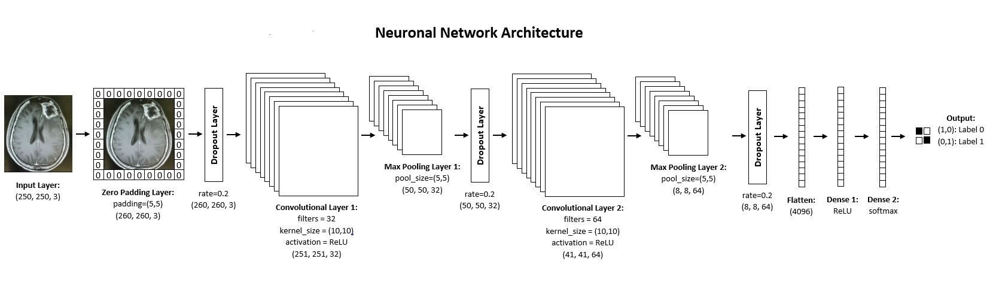

# Neuronal-Network-for-MRI-Brain-Tumor-Detection

The medical diagnosis brain tumor is received with the magnetic resonance imaging technique. Magnetic fields and radio waves are used to generate images of the texture of the brain. Thereby morbid changes in the brain could be detected. 
Here a neuronal network is implemented for the brain tumor detection of such MRI images. 

## Datasets:

The used datasets are founded on Kaggle. You can find it here:
- https://www.kaggle.com/navoneel/brain-mri-images-for-brain-tumor-detection
- https://www.kaggle.com/sartajbhuvaji/brain-tumor-classification-mri

The first dataset contains two folders “yes” and “no”. The no folder contains 98 brain MRI images that are non-tumorous and the yes folder contains 155 brain MRI images that are tumorous.

The second dataset contains four folders: “glioma_tumor”, “meningioma_tumor”, “pituitary_tumor” and “no_tumor”. The data was primary divided in testing and training folder, but here they are merged together. Images in the glioma, meningioma and pituitary folders represent different types of brain tumors. In this implementation no classification between these different types is performed. In the glioma folder are 926, in meningioma 937, in pituitary 901 and in the no folder 500 brain MRI images. 

**Total dataset contains therefore:** 
**598** brain MRI images without brain tumor 
**2919** brain MRI images with brain tumor

## Data Preprocessing:

1. Crop images: All images will be cropped, so that the non-zero regions will be removed and only the part of the brain will remain.

2. Resize images: As each image have a different pixel size every image needs to be resized to a common shape of (250,250,3). This is necessary for the neuronal network. 

3. Normalization: Normalization of each image is applied to scale the pixel values to the range from 0 to 1.

4. Generate train and test data The whole dataset is splitted into train data and test data: 
- 70 % of dataset for train data
- 30 % of dataset for test data

## Neuronal Network Architecture:

A neuronal network is designed by using Tensorflow and Keras. Each image has an input shape of (250,250,3). For training the neuronal network all train images will be used. The architecture of the neuronal network is the following:

**Layer Description:**

1. ZeroPadding Layer: The ZeroPadding Layer is able to add rows and columns of zeros around the image to cover also the borders of the image to reach better accuracy. Here padding is set to padding=(5,5) to add 5 rows and columns around the image.

2. Dropout Layer: The Dropout Layer is able to prevent overfitting by randomly dropping out nodes during training. Here the frequency rate is set to rate=0.2 to remove 0.2 % of neurons out of the analysis.

3. Convolutional Layer: The Convolutional Layer multiplies the image with different filters. Here 32 filters with the kernel_size=(10,10) will be used for convolution. The filter is moving with stride size (1,1) over the image and using the ReLU activation function.

4. MaxPooling Layer: The MaxPooling Layer downsamples the output of the Convolutional Layer by taking the maximum value of the defined pool size. Here the pool_size is set to (5,5).

5. The steps 2, 3, 4, 2 will repeated. 

6. Flatten Layer: The Flatten Layer reshapes the output into a one-dimensional vector.

7. Dense Layer 1: The first Dense Layer calculates the ReLU activation.

8. Dense Layer 2: The second Dense Layer calculates the softmax activation.

## Results:

The training of the neuronal network with given architecture delivers following accuracies:

Train Accuracy | Test Accuracy
-------------- | -------------
81.63 % | 86.17 %

Therefore the prediction delivers 910 out of 1056 correct predicted brain MRI images. 
