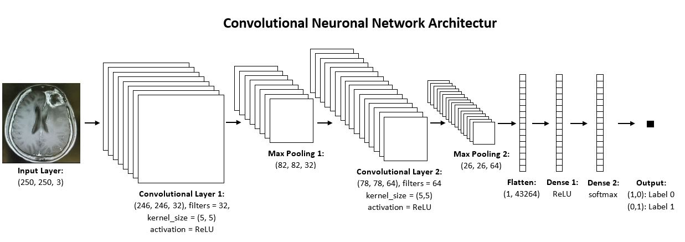

# Neuronal-Network-for-MRI-Brain-Tumor-Detection

The medical diagnosis brain tumor is received with the magnetic resonance imaging technique. Magnetic fields and radio waves are used to generate images of the texture of the brain. Thereby morbid changes in the brain could be detected. 
Here a neuronal network is implemented for the brain tumor detection of such MRI images. 

## Datasets:

The used dataset are founded on Kaggle. You can find it here:
- https://www.kaggle.com/navoneel/brain-mri-images-for-brain-tumor-detection
- https://www.kaggle.com/sartajbhuvaji/brain-tumor-classification-mri

The first dataset contains two folders “yes” and “no”. The no folder contains 98 brain MRI images that are non-tumorous and the yes folder contains 155 brain MRI images that are tumorous.

The second dataset contains four folders: “glioma_tumor”, “meningioma_tumor”, “pituitary_tumor” and “no_tumor”. The data was primary divided in test and training folder, but here they are merged together. Images in the glioma, meningioma and pituitary folders represent different types of brain tumors. In this implementation no classification between these different types is performed. In the glioma folder are 926, in meningioma 937, in pituitary 901 and in the no folder 500 brain MRI images. 

**Total dataset contains therefore:**

**598** brain MRI images without brain tumor 
**2919** brain MRI images with brain tumor

## Data Preprocessing:

1. Crop images: All images will be cropped, so that the non-zero regions will be removed and only the part of the brain will remain.

2. Resize images: As each image have a different pixel size every image needs to be resized to a common shape of (250,250,3). This is necessary for the neuronal network. 

3. Normalization: Normalization of each image is applied to scale the pixel values to the range from 0 to 1.

4. Generate train and test data The whole dataset is splitted into train data and test data:
- 70 % of dataset for train data
- 30 % of dataset for test data

5. Define softmax: BLA.....

## Neuronal Network Architecture:

A Neuronal Network is designed by using Tensorflow and Keras. Following architecture is used:

**Layer Description:**

1. ....
2. ....
...

## Results:

The training of the Neuronal Network with given architecture delivers following accuracies:

Train Accuracy | Test Accuracy
------------------------------
81.58 % | 85.87 %

Train Accuracy | Test Accuracy
-------------- | -------------
81.58 % | 85.87 %
Content in the first column | Content in the second column

There are ... out of ... correct predicted brain MRI images. 
